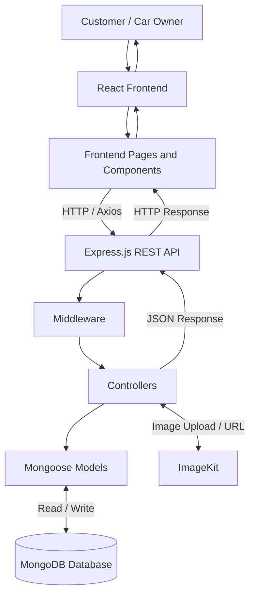
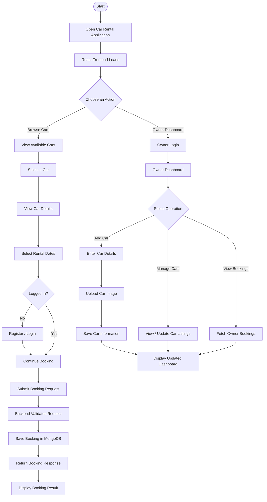
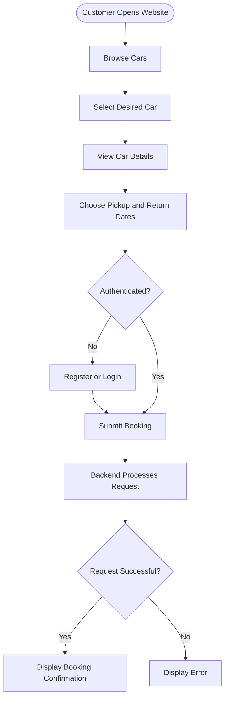
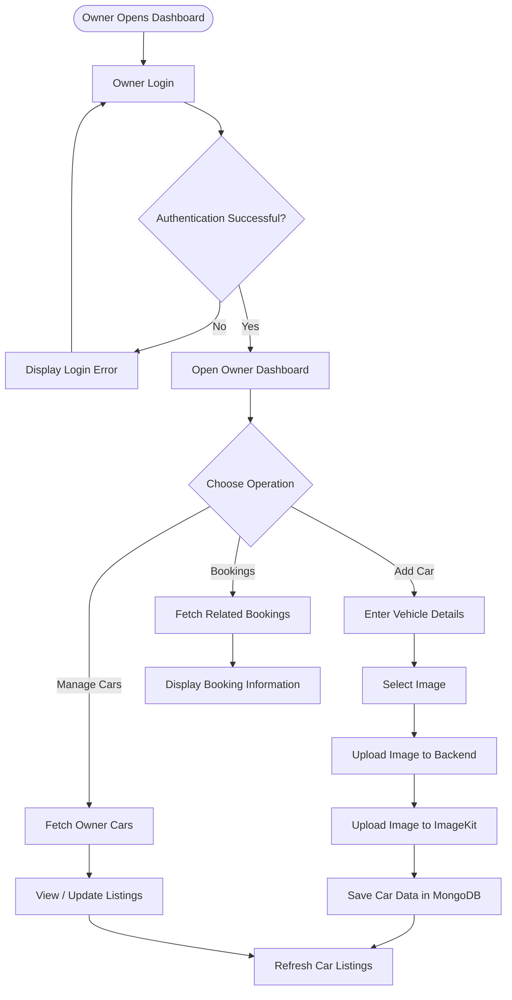
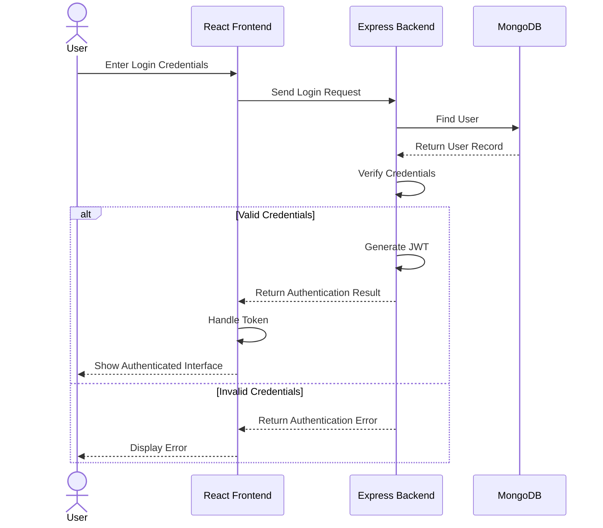
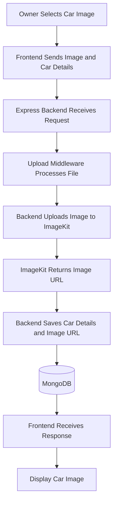
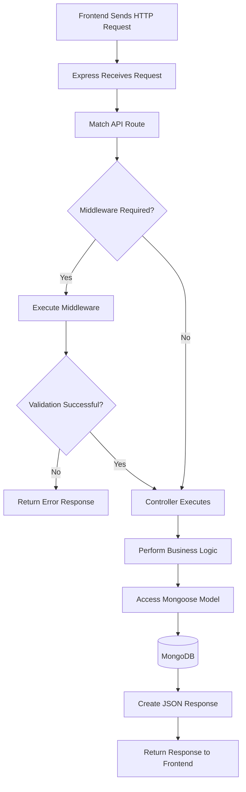
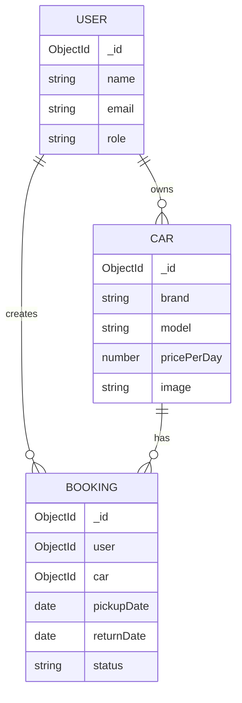

# 🚗 Car Rental – Full Stack MERN Application

A full-stack car rental web application built using the MERN stack. It allows users to explore available cars, book vehicles for rental and manage their bookings. Car owners can list their vehicles, manage cars and monitor customer bookings.

**Repository:** [Car Rental – GitHub](https://github.com/Singh-Devanand/Car-Rental)

---

## 📑 Table of Contents

1. [Project Overview](#-project-overview)
2. [Key Features](#-key-features)
3. [Technology Stack](#-technology-stack)
4. [System Architecture](#-system-architecture)
5. [Complete Application Flow](#-complete-application-flow)
6. [Customer Flow](#-customer-flow)
7. [Owner Flow](#-owner-flow)
8. [Authentication Flow](#-authentication-flow)
9. [Car Image Upload Flow](#-car-image-upload-flow)
10. [Project Structure](#-project-structure)
11. [Backend Request Lifecycle](#-backend-request-lifecycle)
12. [Database Relationships](#-database-relationships)
13. [Installation and Setup](#-installation-and-setup)
14. [Environment Variables](#-environment-variables)
15. [Running the Application](#-running-the-application)
16. [Future Enhancements](#-future-enhancements)
17. [Author](#-author)

---

## 📌 Project Overview

**Car Rental** is a full-stack web application designed to simplify the process of renting and managing cars.

The application provides two primary interfaces:

* **Customer Interface:** Allows customers to browse cars, view vehicle details, select rental dates and make bookings.
* **Owner Dashboard:** Allows car owners to add vehicles, manage their listings and view bookings associated with their cars.

The frontend is developed using React.js, while the backend uses Node.js and Express.js. MongoDB is used for data storage, JWT for authentication and ImageKit for image management.

### 🎯 Project Objectives

* Simplify the online car rental process.
* Provide a convenient interface for customers and car owners.
* Manage car listings and rental bookings digitally.
* Implement secure user authentication.
* Build a responsive and maintainable full-stack application.

---

## ✨ Key Features

### 👤 Customer Features

* Browse available cars.
* View car details and rental prices.
* Select pickup and return dates.
* Register and log in.
* Book cars for selected rental periods.
* View personal booking information.

### 🚘 Owner Features

* Access a dedicated owner dashboard.
* Add new cars with their details.
* Upload car images.
* Manage listed vehicles.
* View bookings associated with owned cars.

### ⚙️ Technical Features

* React-based frontend.
* RESTful API architecture.
* JWT-based authentication.
* MongoDB database integration.
* ImageKit image management.
* Responsive user interface.
* Separate frontend and backend.

---

## 🛠️ Technology Stack

| Technology   | Purpose                             |
| ------------ | ----------------------------------- |
| React.js     | Frontend user interface             |
| Vite         | Frontend development and build tool |
| Tailwind CSS | UI styling                          |
| Node.js      | Backend JavaScript runtime          |
| Express.js   | REST API and server                 |
| MongoDB      | Database                            |
| Mongoose     | MongoDB object modelling            |
| JWT          | Authentication                      |
| ImageKit     | Image storage and delivery          |
| Multer       | File upload handling                |
| Git          | Version control                     |
| GitHub       | Source code hosting                 |
| Vercel       | Deployment, where configured        |

---

## 🏗️ System Architecture

The application follows a client-server architecture. The frontend communicates with the backend through HTTP requests. The backend processes requests, interacts with MongoDB and uses ImageKit for image-related operations.



### Architecture Explanation

1. **React Frontend:** Displays the application interface and handles user interactions.
2. **Express API:** Receives HTTP requests from the frontend.
3. **Middleware:** Handles authentication and other request-processing tasks where required.
4. **Controllers:** Process requests and implement application logic.
5. **Mongoose Models:** Provide access to MongoDB documents.
6. **MongoDB:** Stores application data such as users, cars and bookings.
7. **ImageKit:** Handles car-image uploads and image delivery.
8. **JSON Response:** The backend returns the result to the frontend, which updates the UI.

---

## 🔄 Complete Application Flow

The following diagram illustrates the overall journey through the application.



---

## 👥 Customer Flow

The customer flow describes how a user can rent a car through the application.



### Customer Workflow

1. The customer opens the application.
2. The frontend displays the available cars.
3. The customer selects a car and views its details.
4. The customer selects the rental dates.
5. The application checks the required authentication state.
6. The customer submits the booking request.
7. The backend processes the request and saves the booking if valid.
8. The frontend displays the result.

---

## 🧑‍💼 Owner Flow

The owner dashboard provides a dedicated interface for managing vehicles and reviewing bookings.



### Owner Responsibilities

* Authenticate before accessing protected owner features.
* Add vehicles by providing the required information.
* Upload images for vehicle listings.
* Manage existing vehicle records.
* Review relevant customer bookings.

---

## 🔐 Authentication Flow

The application uses JSON Web Tokens (JWT) for authentication.



### How JWT Authentication Works

1. The user submits their login credentials.
2. The backend finds the corresponding user in MongoDB.
3. The backend verifies the credentials.
4. If the credentials are valid, the backend generates a signed JWT.
5. The frontend handles the authentication response.
6. For protected requests, the token is sent according to the application's configured mechanism.
7. The backend verifies the token before allowing access to protected operations.

**Authentication** verifies the identity of a user, while **authorization** determines whether that user has permission to perform a particular operation.

---

## 🖼️ Car Image Upload Flow

ImageKit is used for managing car images.



### Image Upload Explanation

1. The owner selects a car image.
2. The frontend sends the image and vehicle information to the backend.
3. The backend processes the upload.
4. The image is uploaded to ImageKit.
5. ImageKit returns the image URL.
6. The backend stores the vehicle information and image reference.
7. The frontend uses the image URL to display the vehicle image.

Private ImageKit credentials should remain on the backend.

---

## 📂 Project Structure

The following is a logical representation of the frontend and backend. Match the paths and filenames with the actual repository before treating this as an exact file inventory.

```text
Car-Rental/
│
├── client/                         # React frontend
│   │
│   ├── public/                     # Static public assets
│   │
│   ├── src/
│   │   ├── assets/                 # Images and icons
│   │   │
│   │   ├── components/             # Reusable UI components
│   │   │   └── owner/              # Owner-specific components
│   │   │
│   │   ├── pages/                  # Application pages
│   │   │
│   │   ├── context/                # Shared React state, if present
│   │   │
│   │   ├── App.jsx                 # Main application component
│   │   └── main.jsx                # React entry point
│   │
│   ├── package.json                # Frontend dependencies
│   └── vite.config.js              # Vite configuration
│
├── server/                         # Node.js backend
│   │
│   ├── config/                     # Service configuration
│   │
│   ├── controllers/                # Application logic
│   │
│   ├── middleware/                 # Authentication and uploads
│   │
│   ├── models/                     # Mongoose models
│   │
│   ├── routes/                     # REST API routes
│   │
│   ├── server.js                   # Backend entry point
│   └── package.json                # Backend dependencies
│
├── .gitignore                      # Git ignore rules
└── README.md                       # Project documentation
```

### 📁 Frontend Folder Explanation

| Folder / File           | Responsibility                                           |
| ----------------------- | -------------------------------------------------------- |
| `public/`               | Contains static files served directly by the frontend.   |
| `src/assets/`           | Contains images, icons and other frontend assets.        |
| `src/components/`       | Contains reusable React components.                      |
| `src/components/owner/` | Contains owner-specific UI components, if present.       |
| `src/pages/`            | Contains page-level components, if present.              |
| `src/context/`          | Contains shared state and context providers, if present. |
| `App.jsx`               | Composes the main application and its routes.            |
| `main.jsx`              | Mounts the React application.                            |
| `vite.config.js`        | Configures Vite.                                         |

### 📁 Backend Folder Explanation

| Folder / File  | Responsibility                                                |
| -------------- | ------------------------------------------------------------- |
| `config/`      | Configures services such as MongoDB and ImageKit, if present. |
| `controllers/` | Contains the logic for processing API requests.               |
| `middleware/`  | Handles authentication, uploads and other request checks.     |
| `models/`      | Defines the MongoDB data structures using Mongoose.           |
| `routes/`      | Maps API endpoints to middleware and controllers.             |
| `server.js`    | Initializes and starts the Express server.                    |
| `package.json` | Contains backend dependencies and scripts.                    |

### 🔗 How the Folders Work Together

For example, when a customer books a car, the typical backend request path is:

```text
React Page / Component
        |
        v
Frontend API Request
        |
        v
Express Route
        |
        v
Authentication Middleware
        |
        v
Booking Controller
        |
        v
Mongoose Booking Model
        |
        v
MongoDB Database
        |
        v
Controller Response
        |
        v
React UI Update
```

This separation keeps the user interface, API routing, business logic and database operations organized.

---

## 🔁 Backend Request Lifecycle

Every API request follows a processing path similar to the one below.



### Request Lifecycle

1. The frontend sends an HTTP request to an API endpoint.
2. Express matches the request with a route.
3. Required middleware processes the request.
4. The controller validates the input and applies business logic.
5. The controller interacts with the relevant Mongoose model.
6. MongoDB returns the result of the database operation.
7. The controller prepares the HTTP response.
8. The frontend handles the response and updates the interface.

---

## 🗃️ Database Relationships

The main data entities in a car rental application are users, cars and bookings.



### Entity Explanation

| Entity  | Description                                                        |
| ------- | ------------------------------------------------------------------ |
| User    | Stores account information and the user's role.                    |
| Car     | Stores vehicle information, rental pricing and an image reference. |
| Booking | Connects a customer with a car and stores rental information.      |

**Note:** This is a conceptual relationship diagram. The actual fields, references and validation rules must match the Mongoose schemas in the repository.

---

## ⚙️ Installation and Setup

### Prerequisites

Before running the project, install:

* Node.js
* npm
* MongoDB Atlas account or a local MongoDB instance
* ImageKit account and credentials for image uploads
* Git

### 1. Clone the Repository

```bash
git clone https://github.com/Singh-Devanand/Car-Rental.git
```

```bash
cd Car-Rental
```

### 2. Install Backend Dependencies

```bash
cd server
npm install
```

### 3. Install Frontend Dependencies

Open another terminal from the project root:

```bash
cd client
npm install
```

### 4. Configure Environment Variables

Create the environment files required by the project. Refer to the environment variable names actually used in the source code.

### 5. Start the Backend

From the server directory, execute the development script if available:

```bash
npm run dev
```

### 6. Start the Frontend

From the client directory, execute:

```bash
npm run dev
```

Open the local URL displayed in the terminal by Vite.

---

## 🔑 Environment Variables

The following are illustrative examples. Use the exact variable names expected by your implementation.

### Backend — `server/.env`

```env
PORT=3000
MONGODB_URI=your_mongodb_connection_string
JWT_SECRET=your_jwt_secret
IMAGEKIT_PUBLIC_KEY=your_imagekit_public_key
IMAGEKIT_PRIVATE_KEY=your_imagekit_private_key
IMAGEKIT_URL_ENDPOINT=your_imagekit_url_endpoint
```

### Frontend — `client/.env`

```env
VITE_BACKEND_URL=http://localhost:3000
```

**Important:** Never commit your real `.env` files, database credentials, JWT secrets or private API keys to GitHub.

---

## ▶️ Running the Application

Start the backend and frontend in separate terminals.

**Backend:**

```bash
cd server
npm run dev
```

**Frontend:**

```bash
cd client
npm run dev
```

Use the frontend development URL printed by Vite to access the application.

If your `package.json` uses different script names, use the scripts defined in your project.

---

## ☁️ Deployment

The application can be deployed using separate hosting services for the frontend and backend.

| Component     | Deployment Option          |
| ------------- | -------------------------- |
| Frontend      | Vercel                     |
| Backend       | Node.js-compatible hosting |
| Database      | MongoDB Atlas              |
| Image Storage | ImageKit                   |

For production deployment:

1. Deploy the backend and configure its environment variables.
2. Configure the production MongoDB connection.
3. Configure ImageKit credentials on the backend.
4. Set the frontend API base URL to the deployed backend.
5. Configure CORS to allow the intended frontend domain.
6. Deploy the frontend.

---

## 🔒 Security Considerations

* Use environment variables to protect sensitive credentials.
* Verify JWTs on protected backend routes.
* Check user roles on owner-only operations.
* Validate incoming API data on the server.
* Configure CORS for the intended frontend origins.
* Do not trust client-provided ownership, roles or prices without server-side verification.

---

## 🚀 Future Enhancements

Potential improvements for future versions include:

* Online payment gateway integration.
* Email notifications for booking updates.
* Advanced car search and filtering.
* Improved booking availability management.
* Automated backend API tests.
* Detailed owner analytics and reports.

These are possible enhancements and should not be considered existing features unless implemented.

---

## 👨‍💻 Author

**Devanand Singh**

* GitHub: [Singh-Devanand](https://github.com/Singh-Devanand)
* Project Repository: [Car Rental](https://github.com/Singh-Devanand/Car-Rental)

---

<p align="center">
  Developed using the MERN Stack 🚗
</p>
